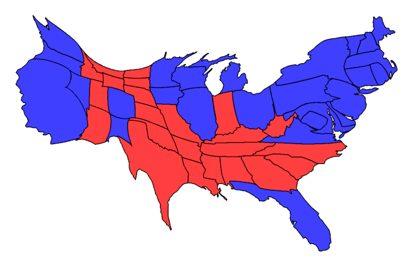
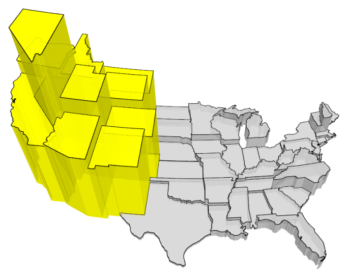
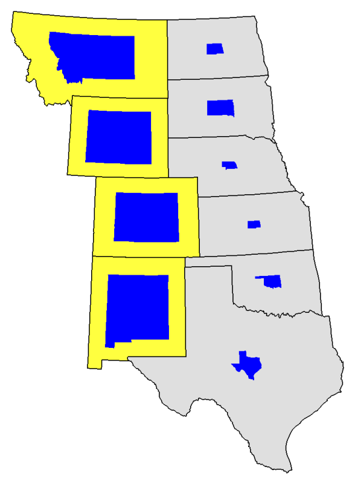
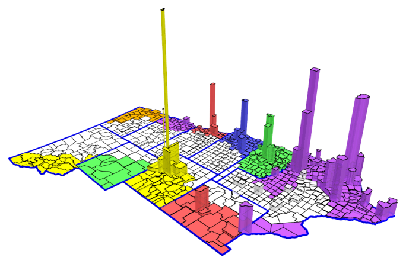

### Cartogram.pl

Cartogram.pl is a command-line tool,
written in Perl,
for generating
cartograms and prism maps.
The quality is suitable for various web purposes
(and at least once, for a university forum),
but real cartographers will probably be disappointed.
For the most part it's glue software --
the heavy lifting is all done by various other open-source tools:

+ GD graphics library
+ Shapefiles for state, county, and congressional districts from the US Census Bureau
+ _Cs2cs_ map projection transformation program from PROJ
+ Gastner and Newman code for gas-diffusion density equalization
+ POVRay ray tracing 3D imaging tool

### Examples

Cartograms are maps where the size of a particular region
is based on a thematic variable other than actual getographic size.
The cartogram people encounter most frequently
is the red/blue US presidential electoral map
with states' area rescaled by number of electoral votes.
This,
and a similar version done at a county level,
have become a regular part of every presidential election.
This type is called a contiguous cartogram.
All of the images here should be larger when examined separately by a browser.

Prism maps can convey similar information.
In this one,
the volume of each state's prism reflects
the number of acres of federally owned land in that state.

The software can also do non-contiguous cartograms where
the thematic variable is represented by a profile of the state
in a contrasting color.
The example below shows the same federal land holdings information
as the prism map.
This works reasonably when
the thematic variable is a percentage between zero and 100.
Note this example shows the software is capable of looking at the data it's handed and
generating maps that contain only the relevant subset of states.

The following prism map illustrating one definition of the US Great Plains
demonstrates several things.

+ Detailed information at the county level
+ An overlay using state outlines
+ Prism map rendering includes a variety of parameters such as rotation

The volume of each county prism represents population,
so the height represents population density
(yes, Denver has a population density comparable to many much older coastal cities).
The Great Plains are fairly clearly defined by the cities that border them,
but are not part of them.

### Incomplete Notes on Getting Started

The purpose of this section is, I suppose, to chase people away.
Consider what you have to do/know in order to make use of the package.
In particular, there's no easy way to install it.
It's not a nicely packaged thing.

*Perl and CPAN.*
You have to know at least enough to get Perl and CPAN installed,
and then a few modules from CPAN.
Most Linux distributions that are more than minimal include them.
For Windows, I suggest Strawberry Perl.
And although I started writing cartogram.pl on a Mac,
I have recently gone to Linux for my regular desktop
because I simply don't want to deal with the potential problems of mixing
two versions of hardware (Intel and M1) and
two versions of the OS (10 and 11).
The Homebrew package manager appears to have made if feasible to pull together
the libraries and programs for the various combinations
excepting Gastner and Newman's specific stuff.

*A bit of C.*
The Gastner and Newman programs are written in C.
They depend on the FFTW discrete Fourier transform library.
In the cart directory
I have included precompiled versions for Linux
(cart, cart2, cartv, cart2v, interp)
and for Windows
(same names with .exe tacked on)
that will probably work.

*Lots of package dependencies.*
Libfftw.
Proj.
POVray.
Ffmeg.
Linux distributions based on Ubuntu with the apt package manager
should be able to provide all of them,
including the (sometimes) long dependency chains.
Similarly for Homebrew on the Mac.
Some hunting online will find sites that have Windows installers.
(For POVRay for Windows, you have to have a thing called MegaPOV that's command-line based.)

*A command line.*
No GUI.
Strictly type stuff at the prompt.
although the program can read options from a flat text file as well.
Command-line options have to have a leading "-" character even on Windows.

### Manifest

+ README.md is the markdown descriptive file converted for web pages by GitHub
+ cartogram.pl is the program source proper
+ bulk_data is a directory with a variety of bulk data, particularly the area in square miles of
US counties and US Congressional districts
+ cart is a directory with all of the Gastner and Newman density equalization stuff
+ generate is a directory that contains files necessary to generate subset maps
(mostly Census Bureau shapefiles)
+ pictures is a directory with the pictures used by README.md
+ examples is a directory with data and options files that should exercise most of the required software
(output as cartogram.png or cartogram.jpg by the program)
+ html is a directory containing a variety of history and anecdotal information
(start from index.html)
